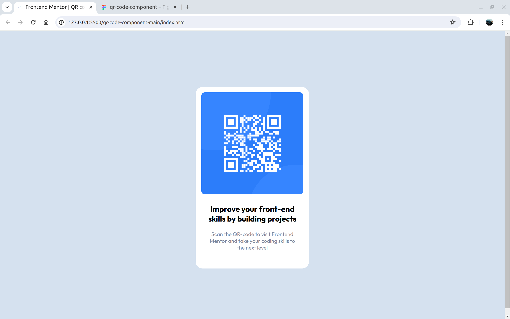
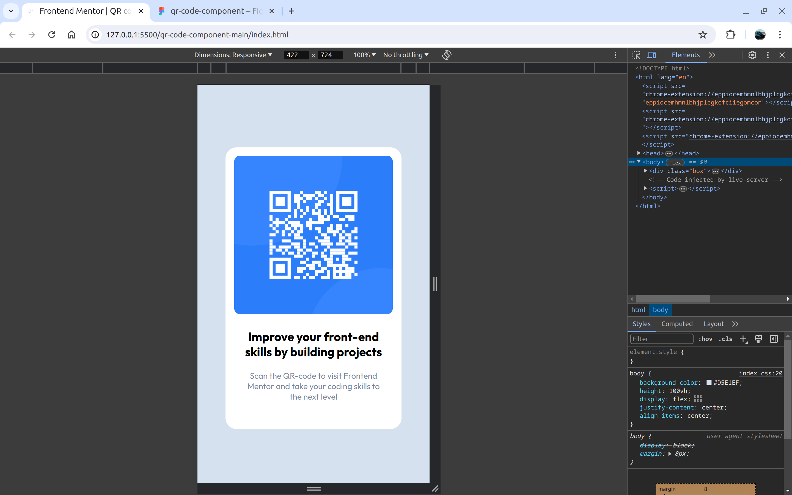

# Frontend Mentor - QR code component solution

This is a solution to the [QR code component challenge on Frontend Mentor](https://www.frontendmentor.io/challenges/qr-code-component-iux_sIO_H). Frontend Mentor challenges help you improve your coding skills by building realistic projects.

## Table of contents

- [Frontend Mentor - QR code component solution](#frontend-mentor---qr-code-component-solution)
  - [Table of contents](#table-of-contents)
  - [Overview](#overview)
    - [Screenshots](#screenshots)
    - [Links](#links)
  - [My process](#my-process)
    - [Built with](#built-with)
    - [What I learned](#what-i-learned)
    - [Useful resources](#useful-resources)
  - [Author](#author)

## Overview

### Screenshots





### Links

- Live Site URL: [Add live site URL here](https://your-live-site-url.com)

## My process

### Built with

- Semantic HTML5 markup
- CSS custom properties
- Flexbox
- Dev Tools

### What I learned

- I learnt how to interpret replicate a design from figma
- Learnt the working of positions, padding, colors

```html
    <div class="textBox">
      <h1 id="t1">Improve your front-end skills by building projects</h1>
      <p id="t2">Scan the QR-code to visit Frontend Mentor and take your coding skills to the next level</p>
    </div>
```

```css
body {
    background-color: #D5E1EF;
    height: 100vh;
    display: flex;
    justify-content: center;
    align-items: center;
}
```

```css
#t1 {
    font-weight: 700;
    font-size: 22px;
    padding: 5px;
    margin-bottom: 0;
}
```


### Useful resources

- [W3Schools](https://www.w3schools.com) - This site gave me a good reference to CSS properties.
- [web.dev](https://web.dev) - It provides a good course on CSS fundamentals.

## Author

- Website - [Add your name here](https://www.your-site.com)
- Frontend Mentor - [Vishal Kaman](https://www.frontendmentor.io/profile/Vishalkaman)
